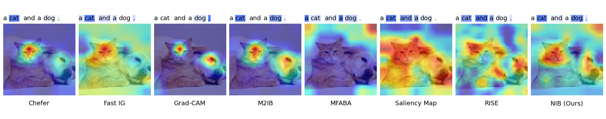
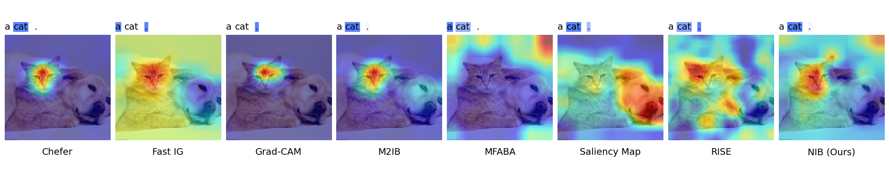
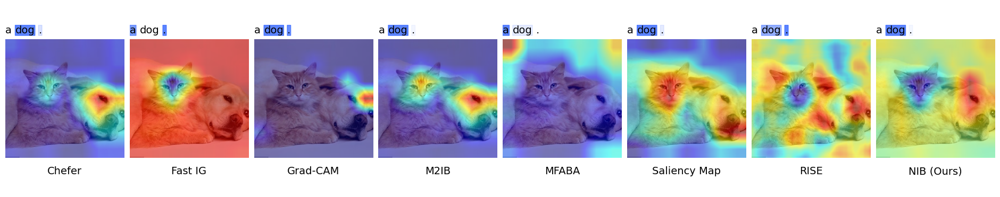

# Narrowing Information Bottleneck (NIB) for Multimodal Image-Text Representation Interpretability

This repository contains the implementation of the **Narrowing Information Bottleneck (NIB)** method, introduced in our ICLR 2025 paper: *Narrowing Information Bottleneck Theory for Multimodal Image-Text Representations Interpretability*.

NIB addresses key limitations in existing interpretability methods for multimodal models, particularly CLIP, by eliminating randomness and hyperparameter dependency while offering more accurate and efficient interpretability results.

## Table of Contents
1. [Introduction](#introduction)
2. [Requirements](#requirements)
3. [Installation](#installation)
4. [Usage](#usage)
5. [Datasets](#datasets)
6. [Experiments](#experiments)
7. [Results](#results)
8. [Citation](#citation)

## Introduction

Multimodal models like CLIP (Contrastive Language-Image Pretraining) excel in tasks such as image-text retrieval and zero-shot classification. However, their interpretability remains a challenge, particularly for high-stakes applications like healthcare.

Our proposed **Narrowing Information Bottleneck (NIB)** theory builds on the Information Bottleneck principle to provide deterministic and robust interpretability for these models by controlling the information flow between the image-text pair. This method ensures that only the most relevant features for a given prediction are highlighted, improving both image and text interpretability.

For more details, refer to our paper: [Narrowing Information Bottleneck Theory for Multimodal Image-Text Representations Interpretability](#).

## Requirements

- Python 3.8+
- PyTorch 1.11+
- torchvision
- transformers
- scikit-learn
- numpy
- matplotlib
- CLIP
- grad-cam
```bash
pip install git+https://github.com/openai/CLIP.git
```

```bash
pip install grad-cam
```


## Datasets

The following datasets are used for our experiments:

- **Conceptual Captions**: Automatically generated image-text pairs.
- **ImageNet**: Large-scale annotated image dataset.
- **Flickr8k**: Image-text dataset for multimodal alignment.


## Experiments

Our experiments compare NIB against several state-of-the-art attribution methods such as:

- M2IB (Multimodal Information Bottleneck)
- RISE
- Grad-CAM

The results are evaluated using the following metrics:
- **Confidence Drop**: Measures performance degradation after removing key features.
- **Confidence Increase**: Measures improvement after removing irrelevant features.
- **Frames per Second (FPS)**: Computational efficiency.

## Results

The NIB method consistently outperforms baseline methods in terms of interpretability and computational efficiency across all datasets. 

|  Dataset  |    Method           	| Image                  	| Image                	| Text                   	| Text                 	|  FPS    |
|----------	|----------------------	|------------------------	|----------------------	|------------------------	|----------------------	|--------	|
|         	|                     	| Conf Drop $\downarrow$ 	| Conf Incr $\uparrow$ 	| Conf Drop $\downarrow$ 	| Conf Incr $\uparrow$ 	|     	  |
| CC       	| M2IB                 	| 1.1171                 	| 39.3                 	| 1.706                  	| 37.4                 	| 0.6621 	|
| CC       	| RISE                 	| 1.4197                 	| 28.8                 	| 0.8002                 	| 43.95                	| 0.1    	|
| CC       	| Grad-CAM             	| 4.1064                 	| 20.2                 	| 1.7994                 	| 34.4                 	| 1.1686 	|
| CC       	| Chefer et al. (2021) 	| 2.0138                 	| 33.65                	| 0.9333                 	| 45.3                 	| 1.272  	|
| CC       	| SaliencyMap          	| 10.4351                	| 2.95                 	| 1.0723                 	| 40.05                	| 0.928  	|
| CC       	| MFABA                	| 10.1878                	| 2.6                  	| 1.0503                 	| 36.25                	| 0.2494 	|
| CC       	| FastIG               	| 10.5117                	| 2.9                  	| 0.9718                 	| 41.25                	| 0.9384 	|
| CC       	| NIB                  	| 0.9439                 	| 42.5                 	| 0.2705                 	| 43.95                	| 1.5817 	|
| ImageNet 	| M2IB                 	| 1.1615                 	| 49.4                 	| 2.6018                 	| 25.4                 	| 0.7995 	|
| ImageNet 	| RISE                 	| 1.001                  	| 54                   	| 0.9928                 	| 46.8                 	| 0.1084 	|
| ImageNet 	| Grad-CAM             	| 2.5483                 	| 33.9                 	| 2.6424                 	| 25.7                 	| 2.3115 	|
| ImageNet 	| Chefer et al. (2021) 	| 1.6636                 	| 44                   	| 1.6732                 	| 29.9                 	| 2.7867 	|
| ImageNet 	| SaliencyMap          	| 4.7331                 	| 16.4                 	| 1.7631                 	| 33.1                 	| 1.5711 	|
| ImageNet 	| MFABA                	| 5.0242                 	| 12.7                 	| 1.7437                 	| 28.5                 	| 0.2758 	|
| ImageNet 	| FastIG               	| 4.7905                 	| 16.9                 	| 1.6486                 	| 34.8                 	| 1.5384 	|
| ImageNet 	| NIB                  	| 0.9012                 	| 53.1                 	| 0.4193                 	| 56.1                 	| 2.4481 	|
| Flickr8k 	| M2IB                 	| 1.4731                 	| 28.1                 	| 2.0783                 	| 34.7                 	| 0.7397 	|
| Flickr8k 	| RISE                 	| 3.01                   	| 5.7                  	| 0.8914                 	| 46.4                 	| 0.1076 	|
| Flickr8k 	| Grad-CAM             	| 5.1869                 	| 13.6                 	| 2.1823                 	| 34.2                 	| 1.958  	|
| Flickr8k 	| Chefer et al. (2021) 	| 2.6214                 	| 26.8                 	| 1.362                  	| 42.6                 	| 2.4601 	|
| Flickr8k 	| SaliencyMap          	| 12.154                 	| 0.1                  	| 1.0797                 	| 45.9                 	| 1.3973 	|
| Flickr8k 	| MFABA                	| 12.07                  	| 0.1                  	| 1.1551                 	| 42.6                 	| 0.2748 	|
| Flickr8k 	| FastIG               	| 12.2244                	| 0.1                  	| 1.3098                 	| 43.9                 	| 1.3944 	|
| Flickr8k 	| NIB                  	| 1.4495                 	| 28.1                 	| 0.4562                 	| 55.3                 	| 2.1995 	|







## Citation
coming soon

## Reference

Code refer to [M2IB](https://github.com/YingWANGG/M2IB)

## Demo
[](https://colab.research.google.com/github/LMBTough/NIB/blob/main/colab/demo.ipynb)

<!-- If you find this code useful for your research, please cite:

```

``` -->
